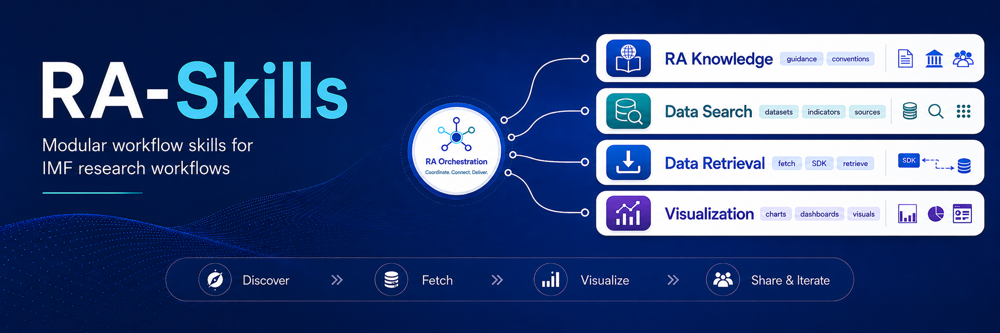

<h1 align="center">RA-Skills</h1>

<p align="center">
  <a href="https://docs.claude.com/en/docs/claude-code">Claude Code</a> skills to help you be the laziest IMF Research Analyst — natural-language data discovery, retrieval, and chart handoff.
</p>

<p align="center">
  <a href="LICENSE"></a>
  <a href="https://docs.claude.com/en/docs/claude-code"></a>
  
</p>

<p align="center">
  
</p>


## Key features

| Skill | What it does |
|---|---|
| **`imf-ra`** | Family entry point. Loads shared conventions (country codes, frequencies, dates, units, SDK setup) and routes to the right worker. |
| **`imf-ra-catalog`** | Plain English → `(database, dimension_name, code, frequency, geo)`. Surfaces top candidates and asks for confirmation when a request is ambiguous. |
| **`imf-ra-data`** | Fetches single series or multi-country panels through the internal Python SDK. Honors LIVE vs vintage explicitly. |
| **`imf-ra-charts`** | Hands tidy data to the internal charting tool. *Scaffolded — not yet implemented; route requests here only when wired up.* |

Recommended chain: `imf-ra` → `imf-ra-catalog` → `imf-ra-data` → `imf-ra-charts`.

Reference truth lives in CSVs (`imf-ra-catalog/databases/…`, `imf-ra-catalog/indicators/…`, and WEO country groups under `imf-ra/references/Country Group/csv/`) so the agent answers from data rather than memory.

## Sample queries

Drop any of these into Claude Code from inside the repo:

- *"I'm starting a project on emerging-market debt — orient me to what's available."*
- *"Which countries are in the WEO advanced economies group?"*
- *"What's the difference between WEO inflation and CPI in IFS?"*
- *"Find the current account balance series."*
- *"Find a quarterly inflation series for emerging markets."*
- *"Pull WEO real GDP growth for G20 countries, 2010–present."*
- *"Download IFS exchange rates monthly for ASEAN, 2015–present."*
- *"Use the April 2024 WEO vintage for nominal GDP."*

More patterns in [`tests/auto_test_instructions.md`](tests/auto_test_instructions.md).

## Quick start

```bash
git clone git@github.com:johnsonice/RA-Skills.git   # or HTTPS: https://github.com/johnsonice/RA-Skills.git
cd RA-Skills
claude   # or open Claude Code with cwd = this repo
```

Skills live under `.claude/skills/` and are **project-local** — Claude Code auto-loads them only when working in this repo. Nothing is installed globally.

## Verify

```bash
bash .claude/skills/imf-ra/scripts/check_references.sh
# Expected: OK: all skills found, all references resolve.
```

Behavioral test pack: [`tests/auto_test_instructions.md`](tests/auto_test_instructions.md). Run logs: [`tests/issue_tracking/`](tests/issue_tracking/).

> **Windows:** run the verify script from **Git Bash** or **WSL** — the shebang is LF-pinned and PowerShell/`cmd` won't execute it.

## Layout

```
RA-Skills/
├── .claude/skills/
│   ├── imf-ra/             # umbrella + shared conventions
│   ├── imf-ra-catalog/     # database / variable-code discovery
│   ├── imf-ra-data/        # SDK-based data fetch
│   └── imf-ra-charts/      # chart handoff (scaffold)
├── docs/specs/             # design docs
├── docs/plans/             # implementation history
├── tests/                  # auto-test instructions + issue tracking
└── CLAUDE.md               # agent conventions for this repo
```
