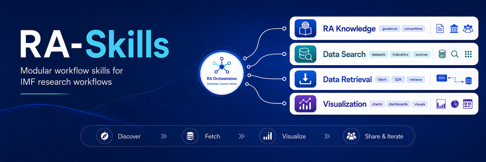

<h1 align="center">RA-Skills</h1>

<p align="center">
  Cross-platform <a href="https://docs.claude.com/en/docs/claude-code">Agent Skills</a> for IMF Research Assistant workflows — natural-language data discovery, country/group resolution, retrieval, chart handoff, and local error reporting. Installs on GitHub Copilot (CLI &amp; cloud agent, incl. Windows), Claude Code, and other Agent Skills hosts.
</p>

<p align="center">
  <a href="LICENSE"></a>
  <a href="https://docs.claude.com/en/docs/claude-code"></a>
  
</p>

<p align="center">
  
</p>


## Key features

| Skill | What it does |
|---|---|
| **`imf-ra`** | Family entry point. Loads shared operating rules, WEO country/group conventions, and routes to the right worker skill. |
| **`imf-ra-catalog`** | Plain English → `(database, dimension_name, code)`. Selects datasets, maps concepts to variable/indicator codes, and asks for confirmation when a request is ambiguous. |
| **`imf-ra-data`** | Fetches single series or multi-country panels through the internal Python SDK after identifiers, dimensions, time range, and output format are confirmed. Honors LIVE vs vintage explicitly. |
| **`imf-ra-charts`** | Hands tidy data to the internal charting tool. *Scaffolded — not yet implemented; route requests here only when wired up.* |
| **`imf-ra-error-report`** | Side skill for user-visible RA-Skills failures. Creates consent-based local JSON reports for system/execution errors or unsatisfactory answers after repeated attempts. |

Recommended chain: `imf-ra` → `imf-ra-catalog` → `imf-ra-data` → `imf-ra-charts`.

Support side path: use `imf-ra-error-report` only when a user wants to report a visible RA-Skills failure. It is not part of the normal data workflow and does not add telemetry, remote upload, GitHub issue creation, dashboards, or background logging.

Reference truth lives in CSVs (`imf-ra-catalog/databases/`, `imf-ra-catalog/indicators/`, and the consolidated WEO country-group file at `imf-ra/Country Group/Country Group.csv`) so the agent answers from data rather than memory.

Key guardrails:

- For catalog indicator/code discovery, source routing, exact code lookup, dimension discovery, database classification, and code comparison, the agent should use the relevant `imf-ra-catalog/scripts/catalog_search.py` command before writing temporary code. Direct CSV/Markdown inspection is still appropriate for exact one-row confirmation and curated guidance.
- WEO country groups are resolved through the self-contained `imf-ra/Country Group/` folder: `weo_country_groups.md` for guidance, `Country Group.csv` for the unified reference matrix, and `weo_country_groups.py` for lookup/expansion commands.
- WEO group/category columns such as `Advanced Economies(AE)` are for group lookup and membership mapping. They should not be used directly as iData country selectors; resolve groups to member `countrycode` values first unless dataset metadata confirms a supported aggregate code.
- For EM/LIC/PRGT requests, the agent should clarify WEO vs SPR/PRGT coverage because the group definitions can differ.
- Error reports are local and consent-based: use `imf-ra-error-report` only after a user-visible failure, and write reports to `tests/user_error_report/` in the structured JSON format defined by the skill.

## Sample queries

Drop any of these into Claude Code from inside the repo:

- *"I'm starting a project on emerging-market debt — orient me to what's available."*
- *"Which countries are in the WEO advanced economies group?"*
- *"Can I use Advanced Economies(AE) directly in an iData pull, or should I expand it to countries?"*
- *"What's the difference between WEO inflation and CPI in IFS?"*
- *"Find the current account balance series."*
- *"Find a quarterly inflation series for emerging markets."*
- *"Pull WEO real GDP growth for advanced economies, 2010–present."*
- *"Download IFS exchange rates monthly for ASEAN, 2015–present."*
- *"Use the April 2024 WEO vintage for nominal GDP."*
- *"Report this RA-Skills issue for the development team."*

More patterns live in the YAML-first auto-test pack:
[`tests/auto_test_cases.yaml`](tests/auto_test_cases.yaml) is the machine-readable source of truth, and
[`tests/auto_test_instructions.md`](tests/auto_test_instructions.md) is the reviewer-facing catalog.

## Install

RA-Skills uses the open **Agent Skills** format; the canonical source is the top-level `skills/` directory.

**GitHub Copilot** (CLI or cloud agent, incl. Windows) — install into your personal skills dir with GitHub CLI ≥ 2.90:

```bash
gh skills install johnsonice/RA-Skills imf-ra-catalog
# repeat for imf-ra, imf-ra-data, imf-ra-charts, imf-ra-error-report as needed
# (the subcommand is `gh skill` on some CLI versions — see GitHub's "Adding agent skills" docs)
```

Manual alternative (no extra CLI): copy the skill folder(s) from `skills/` into `~/.copilot/skills/` (or `~/.agents/skills/`).

**Claude Code** — install the whole family as one plugin:

```text
/plugin marketplace add johnsonice/RA-Skills
/plugin install imf-ra
```

**Any Agent Skills host** (`skills.sh`):

```bash
npx skills add johnsonice/RA-Skills
```

**Local development** — clone and work in-repo on any host:

```bash
git clone https://github.com/johnsonice/RA-Skills.git
cd RA-Skills
python3 scripts/sync_skills.py   # mirror skills/ into .claude/skills + .agents/skills for discovery
claude                           # or open Copilot CLI / Codex with cwd = this repo
```

> On Windows, use `python` or `py -3` in place of `python3`. For a global install that needs the Haver data tier, point `HAVER_DB_PATH` at your `haver.db`.

### Dependency tiers

| Tier | Commands | Needs | Runs where |
|---|---|---|---|
| **Catalog** | discovery, WEO groups | Python 3.9+ (stdlib + bundled CSVs) | anywhere — laptops, CI, cloud, off-network |
| **Data – iData** | `fetch_idata.py` | internal `imf_datatools` SDK + pandas | IMF-managed Windows / cloud |
| **Data – Haver** | `fetch_haver.py` | `haver.db` (+ pandas) | IMF machines with Haver access |

The catalog tier works everywhere; the data tiers require IMF-internal infrastructure. See [AGENTS.md](AGENTS.md) → *Dependencies & environments*.

Behavioral test pack: [`tests/auto_test_cases.yaml`](tests/auto_test_cases.yaml) defines prompts, fixtures, evidence files, and assertions for routing, catalog, data workflow, helper-contract, and end-to-end checks. [`tests/auto_test_instructions.md`](tests/auto_test_instructions.md) mirrors the same cases for human review. Run records and templates live under [`tests/results/`](tests/results/); issue notes live under [`tests/issue_tracking/`](tests/issue_tracking/).

## Layout

```
RA-Skills/
├── skills/                  # CANONICAL source of truth (one folder per skill)
│   ├── imf-ra/              # umbrella + shared conventions
│   │   └── Country Group/   # unified WEO country-group CSV, guide, and helper
│   ├── imf-ra-catalog/      # database / variable-code discovery
│   ├── imf-ra-data/         # SDK-based data fetch
│   ├── imf-ra-charts/       # chart handoff (scaffold)
│   └── imf-ra-error-report/ # local consent-based failure reports
├── .claude-plugin/          # Claude Code plugin + marketplace manifests
├── scripts/                 # sync_skills.py (local-discovery mirror)
├── AGENTS.md                # cross-tool agent guidance (CLAUDE.md imports it)
├── requirements.txt         # data-tier deps (pandas, openpyxl)
├── docs/specs/              # design + distribution docs
├── docs/plans/              # implementation history
└── tests/                   # YAML auto-test cases, reviewer catalog, results, issue tracking
```

The `.claude/skills/` and `.agents/skills/` directories are **generated mirrors** for local discovery (Claude Code / Copilot+Codex respectively) — produced by `scripts/sync_skills.py` and gitignored. Edit `skills/`, never the mirrors.
